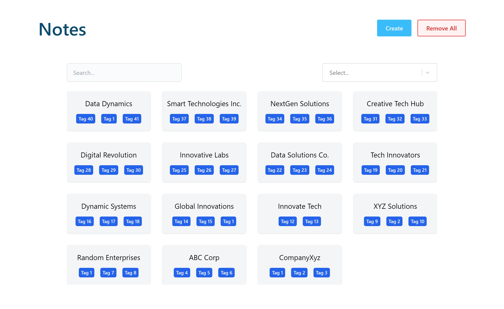

# Notes



You can view the project live here: <a href="https://notes-reactts.netlify.app/" target="_blank">Notes</a>

## 📂 Table of Contents

- [Description](#-description)

- [Key Features](#-key-features)

- [Technologies Used](#-technologies-used)

- [Installations and Tests](#-installations-and-tests)

## 📝 Description

An intuitive Note-Taking App that streamlines your information management. Create, update, and remove notes effortlessly. The app includes a robust search and filter functionality for quick access. All your notes are securely saved in local storage, ensuring accessibility anytime, anywhere.

The Notes app is tested using the React Testing Library. Unit tests were challenging when testing most components..

### 🔑 Key Features

- <b>Create Notes</b>:
  Easily create new notes by tapping the "New Note" button.

- <b>Update Notes</b>:
  Modify and enhance your existing notes effortlessly.

- <b>Remove Notes</b>:
  Declutter your workspace by removing notes you no longer need. Clicking the delete button will prompt you to confirm before deleting.

- <b>Search Notes</b>:
  Find specific notes with the powerful search feature.

- <b>Filter Notes</b>:
  Organize your notes efficiently by using filters. Categorize notes by tags making it easy to locate and manage related information.

- <b>Save to Local Storage</b>:
  Your notes are securely stored in the app's local storage, ensuring that your information is available even when you're offline. The app automatically syncs with the local storage, providing a seamless experience.

[Back To The Top](#notes)

## 💾 Technologies Used

<p style="margin-left:18px;margin-top:30px;display:flex; gap:18px;">
    <a href="https://reactjs.org/" target="_blank" rel="noreferrer">
        
    </a>
    <a href="https://www.typescriptlang.org/" target="_blank" rel="noreferrer">
    
    </a>
    <a href="https://tailwindcss.com/" target="_blank" rel="noreferrer"></a>
</p>

[Back To The Top](#notes)

## 💻 Installations and Tests

To install dependencies, run these commands

```
npm i
```

To run development environment, run these commands

```
npm run dev
```

To run tests, run these commands

```
npm test
```

## 📧 Questions

For additional questions, contact me at the email provided below.

- GitHub [Dusan Madjar](https://github.com/Djarma12)
- Email madjardusan@gmail.com

[Back To The Top](#notes)
